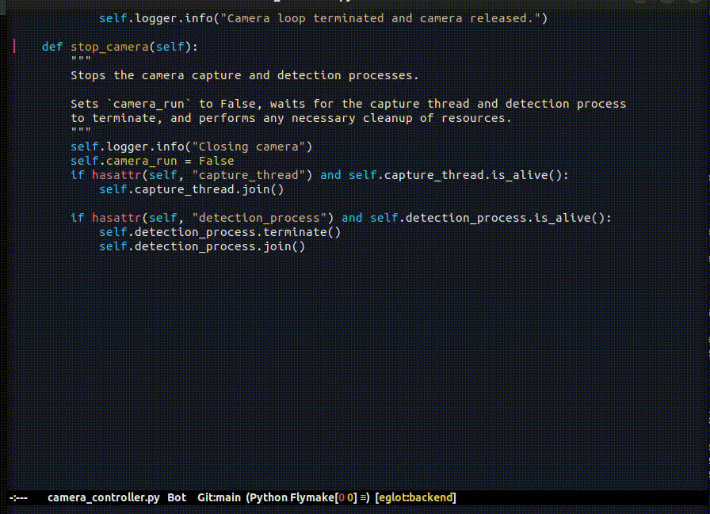

#+OPTIONS: ^:nil tags:nil num:nil

* About

=km-py.el= is a utility library that enhances the Python development experience in Emacs by integrating with several Python environment management systems such as =Poetry=, =Pipenv=, =virtualenv=, and =pip=.

It provides automatic configuration of Python LSP servers, virtual environment activation, and convenient shell-interaction functions, aiming to offer a seamless workflow for Python projects within Emacs.

* Table of Contents                                       :TOC_2_gh:QUOTE:
#+BEGIN_QUOTE
- [[#about][About]]
- [[#requirements][Requirements]]
- [[#installation][Installation]]
  - [[#with-use-package-and-straightel][With use-package and straight.el]]
  - [[#manual-installation][Manual installation]]
- [[#usage][Usage]]
  - [[#running-python-files-and-modules][Running Python files and modules]]
  - [[#environment-variables-and-pythonpath][Environment variables and PYTHONPATH]]
  - [[#configuration-scopes][Configuration scopes]]
  - [[#inferior-python-shells][Inferior Python shells]]
  - [[#other-commands][Other commands:]]
- [[#tests][Tests]]
#+END_QUOTE

* Requirements

| Name                | Version |
|---------------------+---------|
| Emacs               |    29.1 |
| ~project~           |  0.10.0 |
| ~python~            |    0.28 |
| ~eglot~             |    1.15 |
| ~pyvenv~            |    1.21 |

* Installation

** With use-package and straight.el
#+begin_src elisp :eval no
(use-package km-py
  :demand t
  :after (python)
  :bind ((:map python-mode-map
          :package python
          ("C-<return>" . km-py-shell-send-buffer)
          ("C-c C-c" . km-py-shell-send-buffer)
          ("C-c C-r" . km-py-run-dwim)
          ("C-c C-y" . km-py-yank))
         (:map python-ts-mode-map
          :package python
          ("C-<return>" . km-py-shell-send-buffer)
          ("C-c C-c" . km-py-shell-send-buffer)
          ("C-c C-r" . km-py-run-dwim)
          ("C-c C-y" . km-py-yank)))
  :straight (km-py
             :repo "KarimAziev/km-py"
             :type git
             :host github)
  :commands (km-py-setup-enable)
  :config (km-py-setup-enable))
#+end_src

** Manual installation

Download the source code and put it wherever you like, e.g. into =~/.emacs.d/km-py/=

#+begin_src shell :eval no
git clone https://github.com/KarimAziev/km-py.git ~/.emacs.d/km-py/
#+end_src

Add the downloaded directory to the load path:

#+begin_src elisp :eval no
(add-to-list 'load-path "~/.emacs.d/km-py/")
(require 'km-py)
#+end_src

* Usage

After installing or loading the library into your Emacs setup, you can enable the Python environment setup by calling =km-py-setup-enable=.

To disable the setup and all advised commands, use =km-py-setup-disable=.

** Running Python files and modules

=M-x km-py-run-dwim= runs the current buffer in a fresh Python process and
shows its output in a compilation buffer.  The command selects the invocation
style from the file's location:

- A file inside a Python package runs with =python -m package.module=.  This
  gives Python enough package context for explicit relative imports such as
  =from .utils import helper=.
- A standalone Python file runs directly as =python /path/to/file.py=.
- A package =__main__.py= runs as its containing package, for example
  =python -m package=.

The module resolver supports both packages at the project root and the common
=src/package/= layout.  Import roots added with =km-py-run-add-pythonpath= may
also contain namespace packages without =__init__.py= files.

Use a prefix argument to edit the execution mode and program arguments:

#+begin_src text
C-u M-x km-py-run-dwim
#+end_src

The related commands are:

- =km-py-run=: prompt for =auto=, =module=, or =file= mode and program
  arguments.
- =km-py-run-file=: force direct filename execution.  With a prefix argument,
  prompt for program arguments.
- =km-py-run-module=: force =python -m= execution.  With a prefix argument,
  prompt for program arguments.
- =km-py-run-repeat=: repeat the last invocation for the current project.
- =km-py-run-describe-context=: display the resolved root, working directory,
  interpreter, command, =PYTHONPATH=, and environment overrides without running
  anything.

Program arguments entered through =km-py-run= are remembered for the project
during the current Emacs session.

By default, a modified source buffer prompts to be saved before it is run.
Customize =km-py-run-save-buffer= to always save or to run the last saved
version without prompting.

** Environment variables and PYTHONPATH

=M-x km-py-run-set-env= prompts for an environment variable and its value.
The default scope is the current project for the rest of the Emacs session.
With a prefix argument, the override is buffer-local instead:

#+begin_src text
M-x km-py-run-set-env
C-u M-x km-py-run-set-env
#+end_src

=M-x km-py-run-unset-env= removes an override from the corresponding scope.
Inherited environment variables that have not been overridden are left intact.
The commands do not call =setenv= and do not modify Emacs's global
=process-environment=.

=M-x km-py-run-add-pythonpath= adds an import root with directory completion.
Its default scope is the project session; a prefix argument makes it
buffer-local.  Relative values configured through Lisp are resolved from the
Python project root.

Every run also adds the project root to =PYTHONPATH=.  An existing =src/=
directory is added automatically.  Configured paths take precedence over these
automatic roots, which in turn take precedence over inherited =PYTHONPATH=
entries.  Duplicate canonical paths are removed.

Use =M-x km-py-run-clear-project-settings= to clear remembered environment,
path, argument, and last-run settings for the current project.

Environment values whose names resemble passwords, tokens, secrets, or API
keys are redacted by =km-py-run-describe-context=.  Customize
=km-py-run-redact-environment-regexp= to change that behavior.

** Configuration scopes

Run settings are merged from weakest to strongest precedence:

1. Global values of =km-py-run-environment= and =km-py-run-pythonpath=.
2. Settings remembered for the project session by interactive commands.
3. Buffer-local or directory-local values.

For persistent project configuration, use directory-local variables.  For
example:

#+begin_src emacs-lisp
((python-base-mode
  . ((km-py-run-environment
      . (("LOG_LEVEL" . "DEBUG")
         ("ROBOT_BACKEND" . "mock")))
     (km-py-run-pythonpath
      . ("." "src")))))
#+end_src

The environment and path variables have safe-local-variable validators, so
well-formed string values do not require evaluating Lisp code.

Set =km-py-run-interpreter= to an explicit Python executable when automatic
virtual-environment discovery is not desired.  Otherwise km-py prefers Python
from the nearest =.env=, =env=, =.venv=, or =venv= directory and then falls back
to the configured Python shell or a Python executable on =exec-path=.

** Inferior Python shells

The one-shot run commands and inferior shells use the same project environment
and import-root settings.  Before starting a shell, km-py configures
=python-shell-process-environment= and =python-shell-extra-pythonpaths=
buffer-locally.  It does not globally activate the virtual environment.

Environment changes cannot alter a Python process that is already running.  If
km-py detects that a managed shell was started with different settings, it
prints a message asking you to restart the shell before relying on the new
values.

=km-py-shell-send-buffer= remains intentionally different from
=km-py-run-dwim=: it evaluates code in a persistent, stateful inferior Python
process.  Use =km-py-run-dwim= when normal file/module execution semantics and
reproducibility matter.

** Other commands:

=M-x km-py-yank=:
Paste the current kill ring entry with adjusted indentation. The inserted text will have its leading indentation adjusted to match the current line's indentation. If the text to be inserted was indented, all lines will be reindented to match the current line's leading spaces and tabs.

=M-x km-py-shell-send-buffer=
This command is similar to =python-shell-send-buffer=, but it automatically runs an inferior Python process if it is not started.

* Tests

The ERT suite includes module resolution, environment precedence, project
isolation, root and =src/= layouts, namespace packages, inferior-shell setup,
and an integration test that executes a package containing a relative import:

#+begin_src shell :eval no
emacs -Q --batch -L . -L test \
  -l test/km-py-tests.el \
  -f ert-run-tests-batch-and-exit
#+end_src
